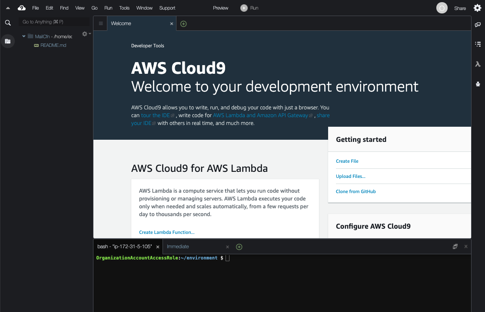

# NetworkFireWallSample


# 環境作成手順
## (1)事前設定
### (1)-(a) 作業環境の準備
下記を準備します。もしCLI実行環境がない場合は、次の(1)-(b)を参照し、Cloud9の環境を準備して実行します。
* bashが利用可能な環境(LinuxやMacの環境)
* aws-cliのセットアップ
* AdministratorAccessポリシーが付与され実行可能な、aws-cliのProfileの設定

### (1)-(b) (Option) Cloud9環境準備
Cloud9利用のためには、インターネット経由でCloud9用のEC2インスタンスにhttpsでアクセス可能である必要があります。
#### (i) Cloud9インスタンスの作成
+ マネージメントコンソールに、AdministratorAccess権限のあるユーザでログインします。
+ サービスから<code>AWS Cloud9</code>に移動します。
+ <code>Create environment</code>ボタンを押します。
+ Name environment
  + NameとDescriptionに任意の情報を入れます。
+ Environment settings  *デフォルトのままでOKですが、念の為記載します。
  + Environment type: <code>Create a new EC2 instance for environment (direct access)</code>を選択
  + Instance type: <code>t2.micro (1 GiB RAM + 1 vCPU)</code>を選択
  + Platform: <code>Amazon Linux</code>
+ Network settings (advanced):
  + デフォルトでは、デフォルトVPCにデプロイされます。基本そのままにします。
+ 設定内容確認
  + 設定内容を確認し、<code>Create environment</code>を実行。
#### (ii) Cloud9環境のアクセスと環境の確認
インスタンスが作成されると、下記のようなCloud9の操作画面がブラウザに表示されます。
以後は、右下のコマンドラインで作業を行います。(画面が小さい場合はコマンドラインを上に拡大することが可能です。)



#### (iii) AWS CLIの実行確認 
コマンドラインで、aws CLIが利用できることを確認します。stsコマンドで、実行に利用するセッション情報が表示できることを確認します。以下の形式でCloud9のインスタンスを作成したユーザの権限情報が表示されれば成功です。

```shell
aws sts get-caller-identity
{
    "UserId": "XXXXXXX:XXXXXX",
    "Account": "XXXXXXXXXXX",
    "Arn": "arn:aws:sts::XXXXXXXXXXX:XXXXXXX/XXXXXX"
}
```
### (1)-(b) 環境作成用ファイルのClone
この構築用のファイル一式を実行環境で展開します。

#### (i) git clone
下記コマンドで検証用資材をgit cloneします。
```shell
git clone https://github.com/Noppy/NetworkFireWallSample.git
cd NetworkFireWallSample/
```
### (1)-(c) CLI実行用の事前準備
これ以降のAWS-CLIで共通で利用するパラメータを環境変数で設定しておきます。
```shell
export PROFILE=default #aa#デフォルト以外のプロファイルの場合は、利用したいプロファイル名を指定
export REGION=$(aws --profile ${PROFILE} configure get region)
echo "${PROFILE}  ${REGION}"
```

## (2)Managed Prefix ListとTransitGateway
### (2)-(a) Managed Prefix List
```shell
aws --profile ${PROFILE} cloudformation create-stack \
    --stack-name NwfwPoC-PrefixList \
    --template-body "file://./src/tgw/managed-prefix.yaml";
```
### (2)-(b) ListとTransitGateway
```shell
aws --profile ${PROFILE} cloudformation create-stack \
    --stack-name NwfwPoC-Tgw \
    --template-body "file://./src/tgw/tgw.yaml";
```
## (3)SystemB環境
### (3)-(a) VPC作成
```shell
aws --profile ${PROFILE} cloudformation create-stack \
    --stack-name NwfwPoC-SystemBVpc \
    --template-body "file://./src/SystemB-Vpc/vpc-6subnets.yaml" \
    --parameters "file://./src/SystemB-Vpc/vpc-parameters.json" \
    --capabilities CAPABILITY_IAM ;
```
### (3)-(b) TGWsのアタッチ
```shell
aws --profile ${PROFILE} cloudformation create-stack \
    --stack-name NwfwPoC-SystemBVpcAttachTgw \
    --template-body "file://./src/SystemB-Vpc/attach-tgw.yaml" ;
```
### (3)-(c) オンプレルートの個別追加
2021.6月時点で、CFnのRoute作成でManaged Prefixが対応していないため、CLIでルートを追加する
```shell
#構成情報取得
RouteTable1Id=$(aws --profile ${PROFILE} --output text \
  cloudformation describe-stacks \
    --stack-name NwfwPoC-SystemBVpc \
  --query 'Stacks[].Outputs[?OutputKey==`PrivateSubnet1RouteTableId`].[OutputValue]' )
RouteTable2Id=$(aws --profile ${PROFILE} --output text \
  cloudformation describe-stacks \
    --stack-name NwfwPoC-SystemBVpc \
  --query 'Stacks[].Outputs[?OutputKey==`PrivateSubnet2RouteTableId`].[OutputValue]' )
RouteTable3Id=$(aws --profile ${PROFILE} --output text \
  cloudformation describe-stacks \
    --stack-name NwfwPoC-SystemBVpc \
  --query 'Stacks[].Outputs[?OutputKey==`PrivateSubnet3RouteTableId`].[OutputValue]' )
OnprePrefixListId=$(aws --profile ${PROFILE} --output text \
  cloudformation describe-stacks \
    --stack-name NwfwPoC-PrefixList \
  --query 'Stacks[].Outputs[?OutputKey==`OnpremisPrefixId`].[OutputValue]' )
OnpreTgwId=$(aws --profile ${PROFILE} --output text \
  cloudformation describe-stacks \
    --stack-name NwfwPoC-Tgw \
  --query 'Stacks[].Outputs[?OutputKey==`OnpremisConnectTgwId`].[OutputValue]' )

echo -n "RouteTable1Id = ${RouteTable1Id}\nRouteTable2Id = ${RouteTable2Id}\nRouteTable3Id = ${RouteTable3Id}\nOnprePrefixListId = ${OnprePrefixListId}\nOnpreTgwId = ${OnpreTgwId}"
```
ルートを追加します。
```shell
#オンプレ経由のルート追加
for table in ${RouteTable1Id} ${RouteTable2Id} ${RouteTable3Id}
do
  aws --profile ${PROFILE} \
    ec2 create-route \
      --route-table-id ${table} \
      --destination-prefix-list-id ${OnprePrefixListId} \
      --transit-gateway-id ${OnpreTgwId} ;
done
```
### (3)-(d) VPC Endpointsの作成
```shell
aws --profile ${PROFILE} cloudformation create-stack \
    --stack-name NwfwPoC-SystemBVpcVpce \
    --template-body "file://./src/SystemB-Vpc/vpce.yaml" ;
```
### (3)-(e) EC2インスタンスの作成
Amazon Linux2の最新AMIのIDを取得します。
```shell
#インスタンス設定
AL2_AMIID=$(aws --profile ${PROFILE} --output text \
    ec2 describe-images \
        --owners amazon \
        --filters 'Name=name,Values=amzn2-ami-hvm-2.0.????????.?-x86_64-gp2' \
                  'Name=state,Values=available' \
        --query 'reverse(sort_by(Images, &CreationDate))[:1].ImageId' ) ;
echo  "AL2_AMIID = ${AL2_AMIID}"
```
上記情報を利用しインスタンスを作成します。
```shell
#パラメータ設定
CFN_STACK_PARAMETERS='
[
  {
    "ParameterKey": "AmiId",
    "ParameterValue": "'"${AL2_AMIID}"'"
  }
]'

#インスタンスの作成
aws --profile ${PROFILE} cloudformation create-stack \
    --stack-name NwfwPoC-SystemBVpcInstance \
    --template-body "file://./src/SystemB-Vpc/instances.yaml" \
    --parameters "${CFN_STACK_PARAMETERS}" \
    --capabilities CAPABILITY_NAMED_IAM ;
```
## (4)OutboundVPC環境
### (4)-(a) Network FireWall Policy作成
```shell
aws --profile ${PROFILE} cloudformation create-stack \
    --stack-name NwfwPoC-NwfwPolicies \
    --template-body "file://./src/Outbound-Vpc/firewall-policy.yaml" ;
```
### (4)-(b) Outbound VPC作成
```shell
aws --profile ${PROFILE} cloudformation create-stack \
    --stack-name NwfwPoC-OutboundVpc \
    --template-body "file://./src/Outbound-Vpc/outbound-vpc.yaml" \
    --capabilities CAPABILITY_NAMED_IAM ;
```
### (4)-(c) TGWのアタッチ
```shell
aws --profile ${PROFILE} cloudformation create-stack \
    --stack-name NwfwPoC-AttachTgwToOutboundVpc \
    --template-body "file://./src/Outbound-Vpc/attach-outboundvpc-to-tgw.yaml" ;
```
### (4)-(d) オンプレルートの個別追加
2021.6月時点で、CFnのRout作成でManaged Prefixが対応していないため、CLIでルートを追加する
```shell
#構成情報取得
RouteTable1Id=$(aws --profile ${PROFILE} --output text \
  cloudformation describe-stacks \
    --stack-name NwfwPoC-OutboundVpc \
  --query 'Stacks[].Outputs[?OutputKey==`NatSubnet1RouteTableId`].[OutputValue]' )
RouteTable2Id=$(aws --profile ${PROFILE} --output text \
  cloudformation describe-stacks \
    --stack-name NwfwPoC-OutboundVpc \
  --query 'Stacks[].Outputs[?OutputKey==`NatSubnet2RouteTableId`].[OutputValue]' )
RouteTable3Id=$(aws --profile ${PROFILE} --output text \
  cloudformation describe-stacks \
    --stack-name NwfwPoC-OutboundVpc \
  --query 'Stacks[].Outputs[?OutputKey==`NatSubnet3RouteTableId`].[OutputValue]' )
VpcsPrefixListId=$(aws --profile ${PROFILE} --output text \
  cloudformation describe-stacks \
    --stack-name NwfwPoC-PrefixList \
  --query 'Stacks[].Outputs[?OutputKey==`VpcsPrefixId`].[OutputValue]' )
VpcsTgwId=$(aws --profile ${PROFILE} --output text \
  cloudformation describe-stacks \
    --stack-name NwfwPoC-Tgw \
  --query 'Stacks[].Outputs[?OutputKey==`VpcConnectTgwId`].[OutputValue]' )

echo -n "RouteTable1Id = ${RouteTable1Id}\nRouteTable2Id = ${RouteTable2Id}\nRouteTable3Id = ${RouteTable3Id}\nVpcsPrefixListId = ${VpcsPrefixListId}\nVpcsTgwId = ${VpcsTgwId}"
```
ルートを追加します。
```shell
#オンプレ経由のルート追加
for table in ${RouteTable1Id} ${RouteTable2Id} ${RouteTable3Id}
do
  aws --profile ${PROFILE} \
    ec2 create-route \
      --route-table-id ${table} \
      --destination-prefix-list-id ${VpcsPrefixListId} \
      --transit-gateway-id ${VpcsTgwId} ;
done
```

## (5)SystemA VPC環境
### (5)-(a) SystemA Inbound用Network FireWall Policy作成
```shell
aws --profile ${PROFILE} cloudformation create-stack \
    --stack-name NwfwPoC-SystemAIngressNwfwPolicies \
    --template-body "file://./src/SystemA-Vpc/firewall-policy-for-ingress.yaml" ;
```
### (5)-(b) System-A VPC作成
```shell
aws --profile ${PROFILE} cloudformation create-stack \
    --stack-name NwfwPoC-SystemAVpc \
    --template-body "file://./src/SystemA-Vpc/systema-vpc.yaml" \
    --capabilities CAPABILITY_NAMED_IAM ;
```
### (5)-(c) TGWsのアタッチ
```shell
aws --profile ${PROFILE} cloudformation create-stack \
    --stack-name NwfwPoC-SystemAVpcAttachTgw \
    --template-body "file://./src/SystemA-Vpc/attach-tgw-to-SystemAVpc.yaml" ;
```
### (5)-(d) オンプレルートの個別追加
2021.6月時点で、CFnのRoute作成でManaged Prefixが対応していないため、CLIでルートを追加する
```shell
#構成情報取得
RouteTable1Id=$(aws --profile ${PROFILE} --output text \
  cloudformation describe-stacks \
    --stack-name NwfwPoC-SystemAVpc \
  --query 'Stacks[].Outputs[?OutputKey==`ResourceSubnetRouteTableId`].[OutputValue]' )
OnprePrefixListId=$(aws --profile ${PROFILE} --output text \
  cloudformation describe-stacks \
    --stack-name NwfwPoC-PrefixList \
  --query 'Stacks[].Outputs[?OutputKey==`OnpremisPrefixId`].[OutputValue]' )
OnpreTgwId=$(aws --profile ${PROFILE} --output text \
  cloudformation describe-stacks \
    --stack-name NwfwPoC-Tgw \
  --query 'Stacks[].Outputs[?OutputKey==`OnpremisConnectTgwId`].[OutputValue]' )

echo -n "RouteTable1Id     = ${RouteTable1Id}\nOnprePrefixListId = ${OnprePrefixListId}\nOnpreTgwId        = ${OnpreTgwId}\n"
```
ルートを追加します。
```shell
#オンプレ経由のルート追加
aws --profile ${PROFILE} \
  ec2 create-route \
    --route-table-id ${RouteTable1Id} \
    --destination-prefix-list-id ${OnprePrefixListId} \
    --transit-gateway-id ${OnpreTgwId} ;

```
### (5)-(e) VPC Endpointsの作成
```shell
aws --profile ${PROFILE} cloudformation create-stack \
    --stack-name NwfwPoC-SystemAVpcVpce \
    --template-body "file://./src/SystemA-Vpc/systema-vpce.yaml" ;
```

### (5)-(f) EC2インスタンス(WebServer)の作成
Amazon Linux2の最新AMIのIDを取得します。
```shell
#インスタンス設定
AL2_AMIID=$(aws --profile ${PROFILE} --output text \
    ec2 describe-images \
        --owners amazon \
        --filters 'Name=name,Values=amzn2-ami-hvm-2.0.????????.?-x86_64-gp2' \
                  'Name=state,Values=available' \
        --query 'reverse(sort_by(Images, &CreationDate))[:1].ImageId' ) ;
echo  "AL2_AMIID = ${AL2_AMIID}"
```
上記情報を利用しインスタンスを作成します。
```shell
#パラメータ設定
CFN_STACK_PARAMETERS='
[
  {
    "ParameterKey": "AmiId",
    "ParameterValue": "'"${AL2_AMIID}"'"
  }
]'

#インスタンスの作成
aws --profile ${PROFILE} cloudformation create-stack \
    --stack-name NwfwPoC-SystemAVpcWebInstance \
    --template-body "file://./src/SystemA-Vpc/systema-web.yaml" \
    --parameters "${CFN_STACK_PARAMETERS}" \
    --capabilities CAPABILITY_NAMED_IAM ;
```